<div align="center">

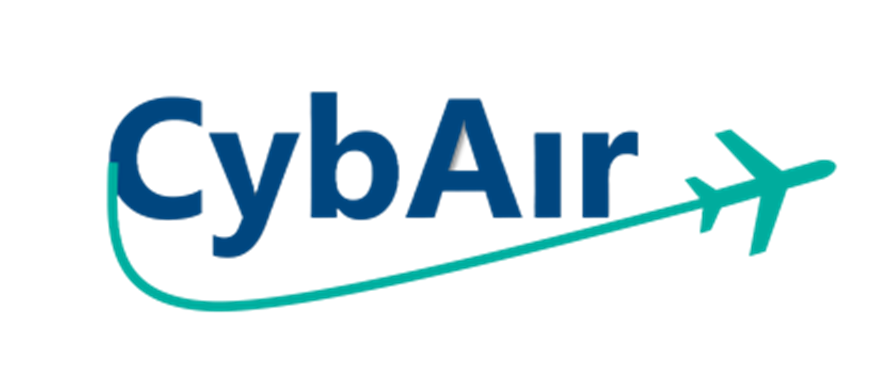


# CybAir - Flight Booking System

**A full-stack desktop flight reservation system built with C# and Windows Forms**

*11th Grade, 5-Unit Software Engineering Project — Cybersecurity & Operating Systems Track*

---

</div>


## Overview

CybAir is a local-network flight booking application that simulates the core experience of a real airline reservation system. It follows a **client-server architecture** where any machine on the local network can act as the server, and all others connect to it as clients - with no internet connection or external infrastructure required.

The system was built from scratch over the course of a full academic year (September–June) as a 5-unit capstone project, covering networking, security, UI design, data management, and real-time synchronization.

---

## Features

### Client
- Browse destination photos on the home screen
- Register and log into a personal account
- Search available flights by destination, date, class, and passenger count
- Select seats based on class and availability
- Simulated payment flow
- View, download, and cancel booked flight tickets (QR-coded)
- Interactive world map showing other opted-in passengers by their home city
- Live encrypted chat with the server (support)

### Server
- Manages all client connections concurrently via multithreading
- Validates registration and login requests
- Queries and returns matching flights from the dataset
- Approves and records flight bookings
- Filters invalid or malformed requests
- Communicates securely with each connected client

---
## Screenshots

<div align="center">

### Home
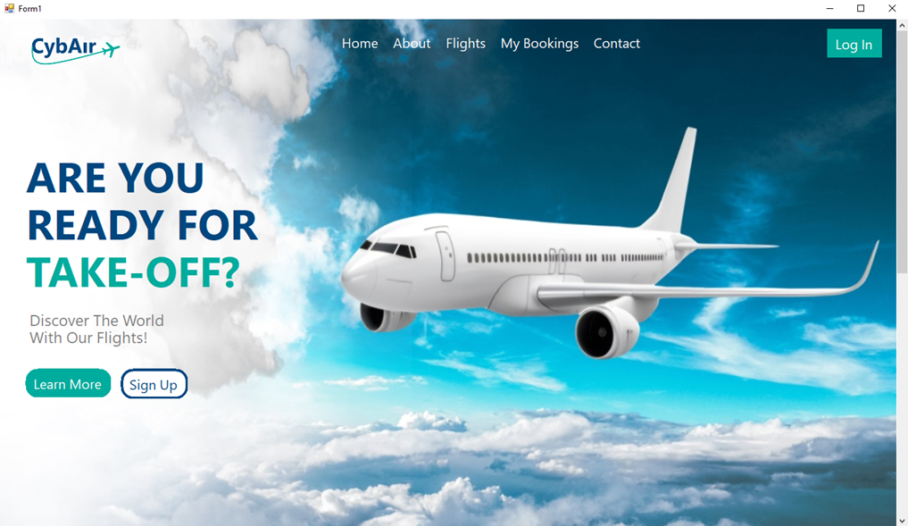
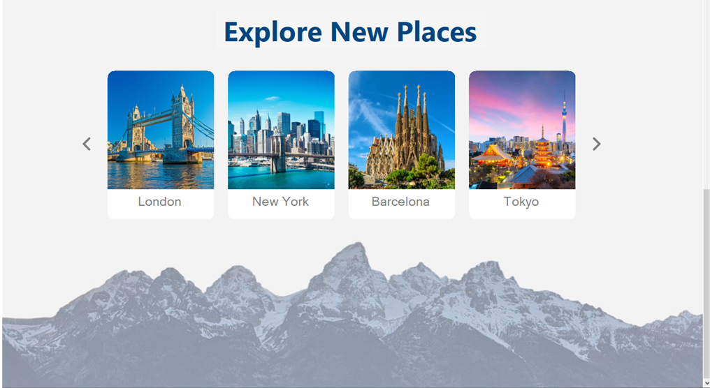

### About
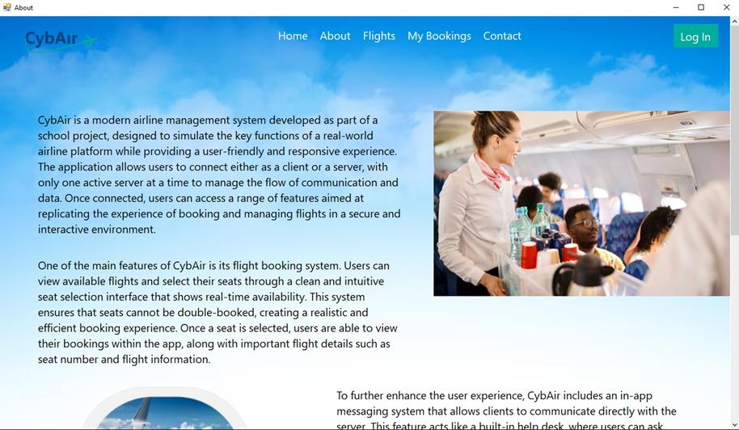

### Login
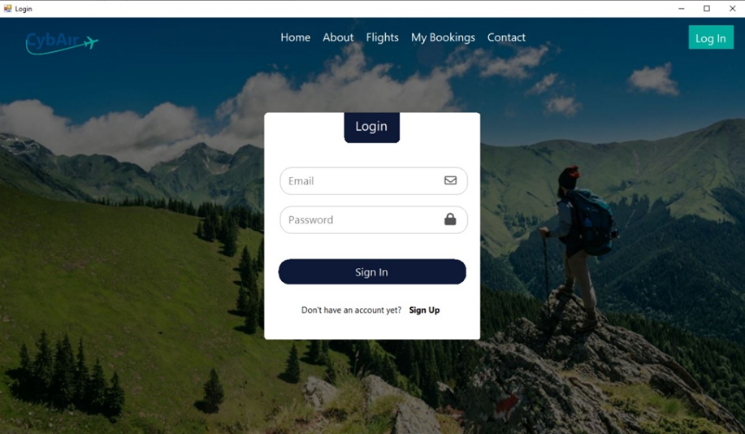

### Sign up
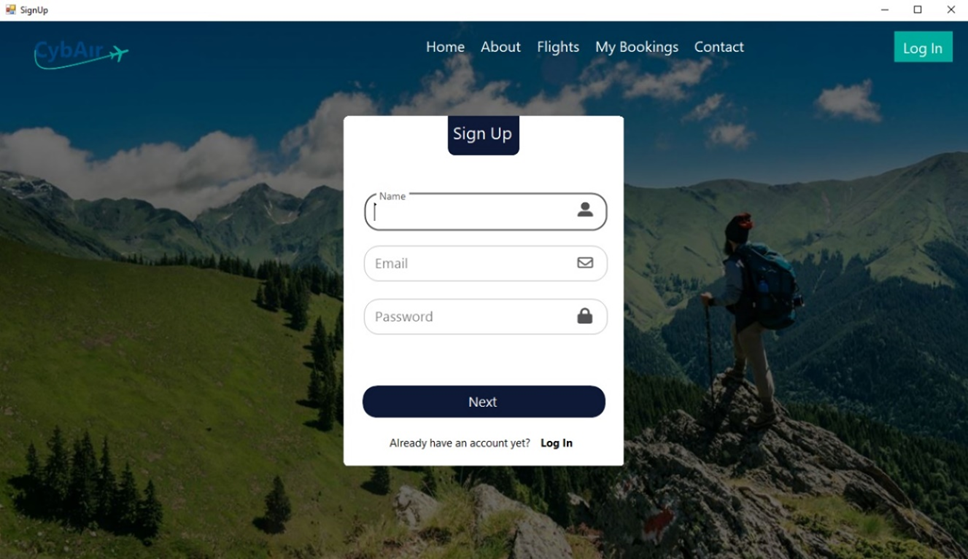
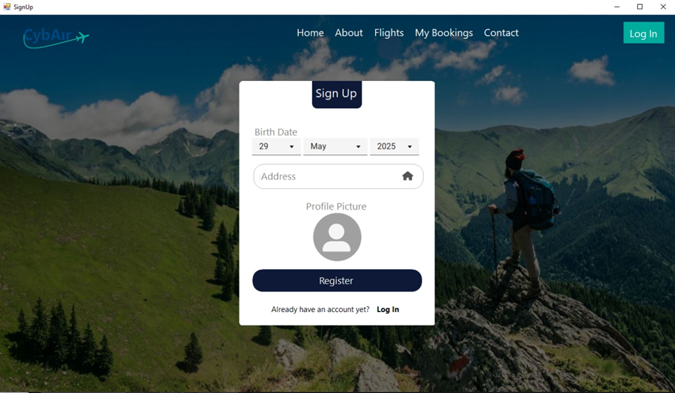

### Search And Book Flights
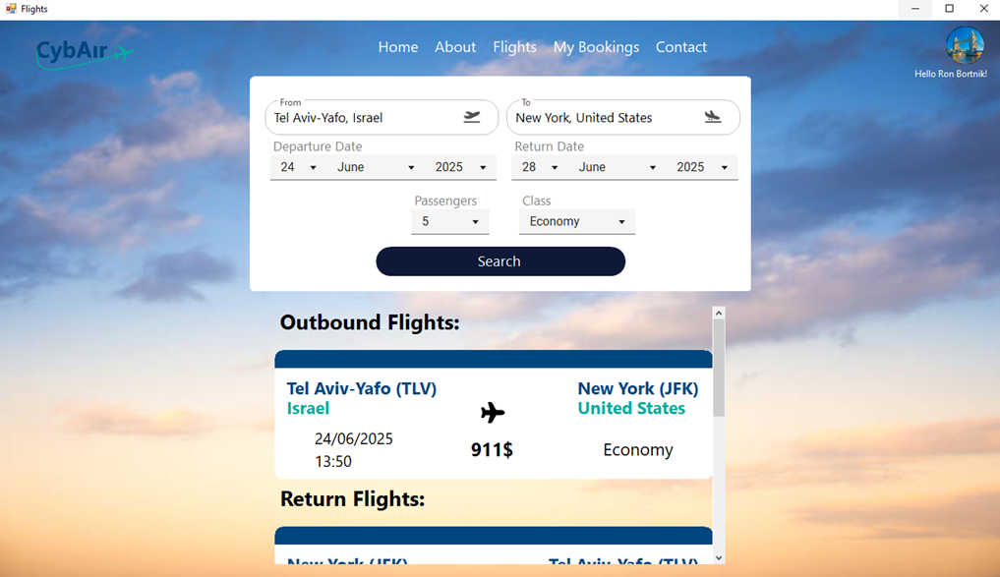
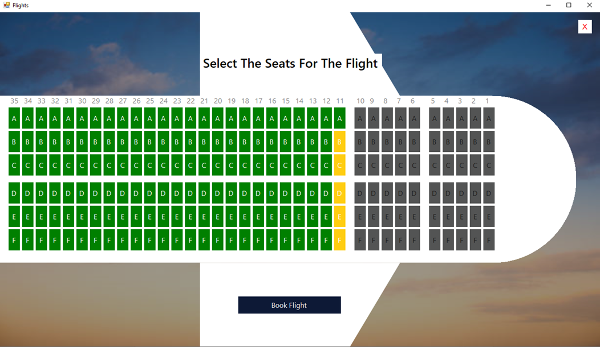

### Bookings And Interactive Map
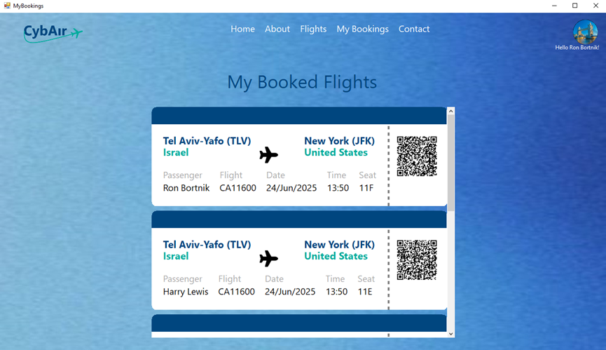
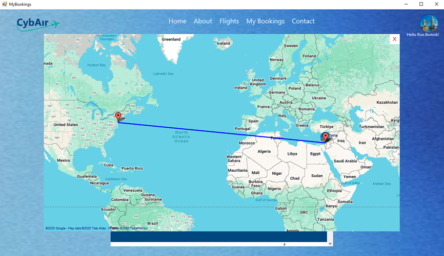

### Customer Support
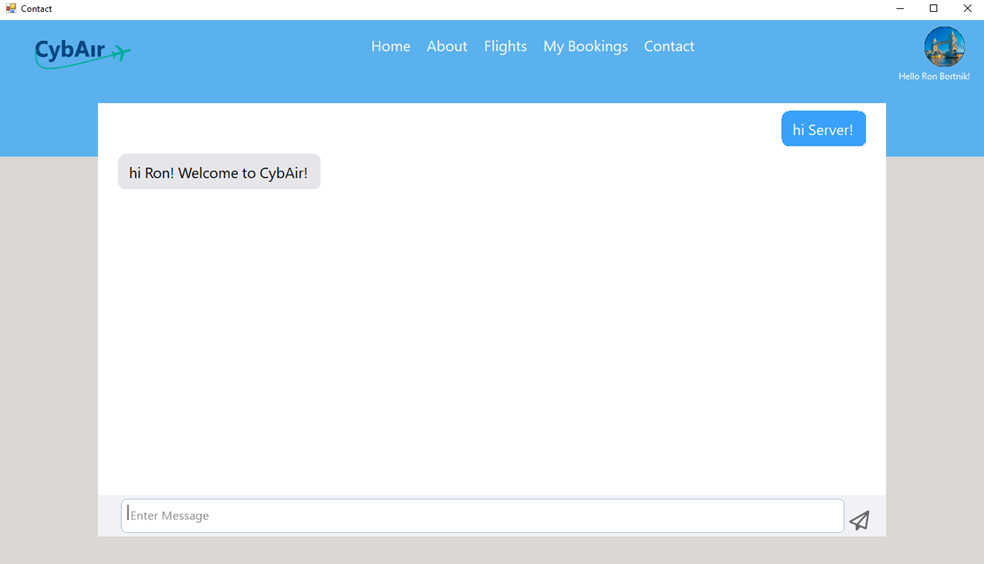


</div>
---

## Tech Stack

| Layer | Technology |
|---|---|
| Language | C# (.NET Framework 4.8) |
| UI | Windows Forms + Guna UI2, MaterialSkin, FontAwesome.Sharp, Krypton Toolkit |
| Networking | TCP (persistent connections, messaging) + UDP (server discovery) |
| Encryption | AES (symmetric), RSA (key exchange), SHA hashing + salting |
| Data | CSV datasets (airports, routes, flights) processed with Python/Pandas |
| Mapping | GMap.NET |
| QR Codes | QRCoder |
| Serialization | Newtonsoft.Json, System.Text.Json |
| Data parsing | CsvHelper |

---

## Architecture

CybAir runs entirely on a local area network (LAN). When the application launches, it uses **UDP broadcast** to determine whether a server already exists on the network. If not, the instance becomes the server automatically - no manual configuration needed.

Once connected, all client-server communication goes over **TCP**, with every message encrypted using **AES**. The AES key itself is exchanged securely via **RSA**. User passwords are never stored in plaintext - they are **hashed and salted** before being written to disk.

Each client connection on the server side runs on its own dedicated thread, allowing real-time concurrent communication with multiple users simultaneously.

---

## Project Structure

```
CybAir-Airline_App/
├── CybAir-Airline_App.sln
└── CybAir-Airline_App/
    ├── Program.cs                  # Entry point
    ├── Data.cs                     # Shared data models & types
    ├── ConnectionManager.cs        # TCP connection lifecycle
    ├── SecurityManager.cs          # AES/RSA encryption, password hashing
    ├── Server.cs                   # Server UI & listener
    ├── ClientHandler.cs            # Per-client server logic
    ├── ActiveFlightsManager.cs     # Real-time flight state
    ├── OnlineUsersManager.cs       # Connected user tracking
    ├── UDP.cs                      # Server discovery
    ├── UI.cs                       # Shared UI utilities
    ├── Login.cs / SignUp.cs        # Auth screens
    ├── Home.cs                     # Home screen
    ├── Flights.cs                  # Flight search & seat selection
    ├── MyBookings.cs               # Booking management
    ├── About.cs / Contact.cs       # Info & support screens
    ├── Data/
    │   ├── flights.csv             # Flight dataset
    │   ├── airports.csv/2          # Airport data
    │   ├── routes.csv              # Route data
    │   ├── worldcities.csv         # City coordinates for map
    │   ├── Users.json              # Registered users (runtime)
    │   └── ActiveFlights.json      # Active flights (runtime)
    ├── Resources/                  # Destination images
    └── Properties/
```

---

## Getting Started

### Requirements
- Windows OS
- Visual Studio 2019 or later
- .NET Framework 4.8

### Setup
1. Clone the repository
2. Open `CybAir-Airline_App.sln` in Visual Studio
3. Build the solution - NuGet packages will restore automatically
4. Run the application on at least two machines on the same local network (or two instances on the same machine for testing)

> The first instance to launch on the network becomes the **server**. All subsequent instances are **clients**.

---

## Project Documentation

The full project book (114 pages, Hebrew) is available in the repository as evidence of the academic work behind this project. It covers the system requirements, architecture diagrams, algorithm descriptions, testing documentation, module breakdowns, and a personal reflection.

---

## A Note on the Code

This project was built during 11th grade as part of a 5-unit software engineering matriculation exam in the Cybersecurity & Operating Systems track. It represents my first real encounter with networking, encryption, multi-threading, and large-scale application design, all self-taught over the course of a single school year.

The codebase reflects that. You'll find legacy patterns, a classic Windows Forms stack, mixing of concerns, and the kind of exploratory decisions you make when you're learning everything for the first time. That's intentional to preserve here. it's an honest snapshot of where I started.

What this project gave me is what matters: a deep, hands-on foundation in how systems actually communicate, how to think about security from first principles, and what it takes to ship something real. Everything I've built since traces back to the habits and intuitions formed here.

---

## Data Sources

- Flight and route data adapted from a real 2013 airline dataset, processed using Python/Pandas
- Airport and world city coordinates from public open datasets

---
